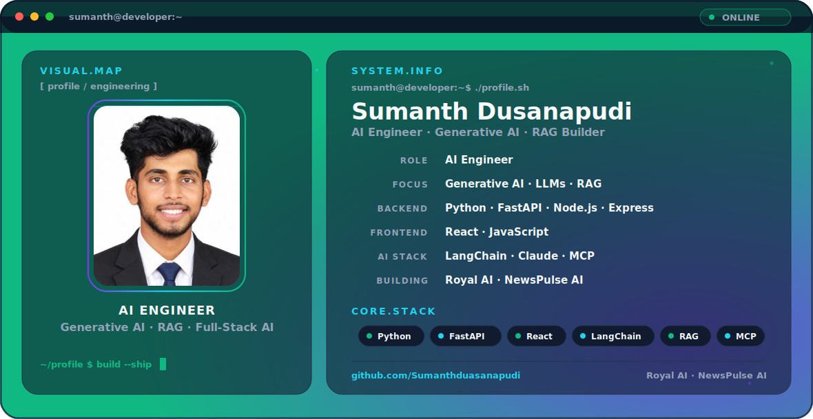

# Hi, I'm Sumanth Dusanapudi 👋

<picture>
  <source media="(prefers-color-scheme: dark)" srcset="./profile-hero-dark-v4.png">
  <source media="(prefers-color-scheme: light)" srcset="./profile-hero-light-v4.png">
  
</picture>

  <b>AI Engineer · Generative AI · RAG · Full-Stack AI Builder</b>

  I build end-to-end AI applications using Python, FastAPI, React, Node.js, LangChain, Claude and RAG workflows.

---

## 🧭 Focus

- Generative AI and LLM applications
- Retrieval-Augmented Generation (RAG)
- FastAPI-based AI services and APIs
- React + Node.js/Express full-stack applications
- MCP and external tool/data integration

## 🌟 Featured Projects

### 🤖 Royal AI
AI assistant with document-based RAG, PDF/DOCX/TXT support, React frontend, Node.js/Express backend and FastAPI AI layer.

[View Royal AI](https://github.com/Sumanthduasanapudi/royal-ai)

### 📰 NewsPulse AI
AI-powered news intelligence project using React, Express, FastAPI, LangChain and Claude for news collection, analysis and structured briefings.

[View NewsPulse AI](https://github.com/Sumanthduasanapudi/newspulse-ai)

## 🧰 Engineering Stack

**AI / LLM:** Generative AI · LLMs · RAG · LangChain · Claude · MCP  
**Backend:** Python · FastAPI · Node.js · Express  
**Frontend:** React · JavaScript · HTML · CSS  
**Tools:** Git · GitHub · VS Code

## 📈 GitHub Activity

  <picture>
    <source media="(prefers-color-scheme: dark)" srcset="https://raw.githubusercontent.com/Sumanthduasanapudi/Sumanthduasanapudi/gh-pages/github-contribution-grid-snake-dark.svg">
    <source media="(prefers-color-scheme: light)" srcset="https://raw.githubusercontent.com/Sumanthduasanapudi/Sumanthduasanapudi/gh-pages/github-contribution-grid-snake.svg">
    
  </picture>

## 🔗 Connect

- GitHub: [@Sumanthduasanapudi](https://github.com/Sumanthduasanapudi)

---

<b>Building · Learning · Improving</b>

