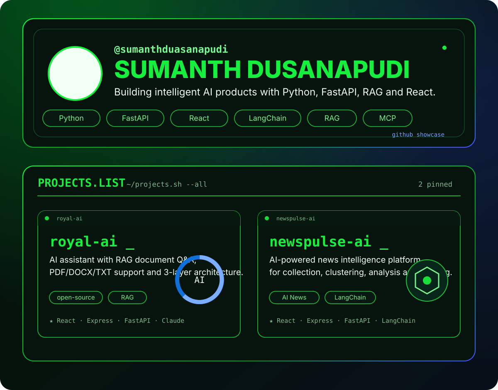

# Hi, I'm Sumanth Dusanapudi 👋

  

  
  
  

## 🐍 Snake Trail

  <picture>
    <source media="(prefers-color-scheme: dark)" srcset="https://raw.githubusercontent.com/Sumanthduasanapudi/Sumanthduasanapudi/gh-pages/github-contribution-grid-snake-dark.svg">
    <source media="(prefers-color-scheme: light)" srcset="https://raw.githubusercontent.com/Sumanthduasanapudi/Sumanthduasanapudi/gh-pages/github-contribution-grid-snake.svg">
    
  </picture>

## 🚀 About Me

- 🤖 Building end-to-end **AI applications**
- 🧠 Working with **Generative AI, LLMs, RAG and LangChain**
- ⚡ Building AI APIs with **FastAPI**
- 🌐 Creating full-stack applications with **React, Node.js and Express**
- 🔌 Learning **MCP**, AI agents and tool integration
- 🎯 Growing as an **AI Engineer**

## 🌟 Featured Projects

### 🤖 Royal AI
AI assistant with RAG-based document Q&A, PDF/DOCX/TXT support and a three-layer architecture.  
[View Royal AI](https://github.com/Sumanthduasanapudi/royal-ai)

### 📰 NewsPulse AI
AI-powered news intelligence application for collection, clustering, analysis and structured briefings.  
[View NewsPulse AI](https://github.com/Sumanthduasanapudi/newspulse-ai)

---

<b>AI • RAG • LangChain • FastAPI • React • MCP</b>

